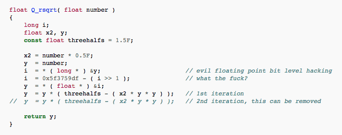
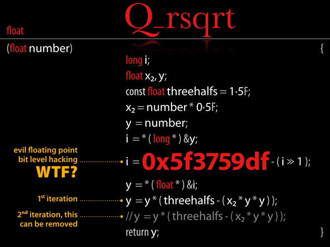

The way we visually present code is stuck in the past, and would be recognisable to the first owner of the 1955 IBM typewriter that introduced the Courier typeface.
Innovations since then are limited to bigger monitors, syntax colouring and better monospace typefaces.
Meanwhile, layout and typography have progressed somewhat further in the 600+ years since Gutenberg’s printing press. 
Unfortunately, source code missed out on the desktop publishing revolution thirty years ago that took layout and typography mainstream.

The goal of this talk is to encourage coders to see code in a new light.
This talk presents examples of how layout and typography can make code beautiful, and considers how this could make programmers’ lives better.
After all, we spend more time reading code that writing it, so we would benefit from making code easier to read.

Finally, we’ll see the next typographical improvement that we’ll actually be able to use some time soon: functional programming font ligatures.

# Example

For example, the [Fast inverse square root](https://en.wikipedia.org/wiki/Fast_inverse_square_root) code would look like this in the average IDE.

However, the following changes, presented one at a time, improve the visual design.

1. Modern typeface
2. Colour scheme more appropriate for game code
3. Header style for function name
4. Two-column layout
5. Pull-out code comments
6. Magic number highlight and abbreviate to ‘WTF’
7. Special characters, superscripts and subscripts
8. Tighten up magic number kerning

The result is much more cool, despite having the same content, and might even be easier to read:

That’s just the start, and is isolated to a small snippet of code.
Other examples will take different directions, such as presenting multiple compilation units in a larger page layout.
